<div align="center">
  
  <br><br>
  <p><strong>Plataforma web de comercio electrónico para venta y lectura de cómics digitales con autenticación, carrito de compras, lector integrado y panel de administración</strong></p>

  
  
  
  
  
  
  
  
</div>

---

## Capturas de Pantalla

<div align="center">
  <h3>Pagina Principal</h3>
  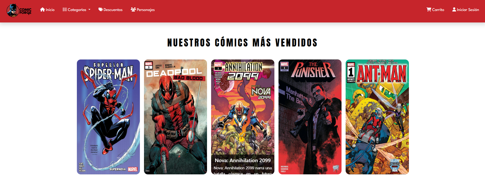
  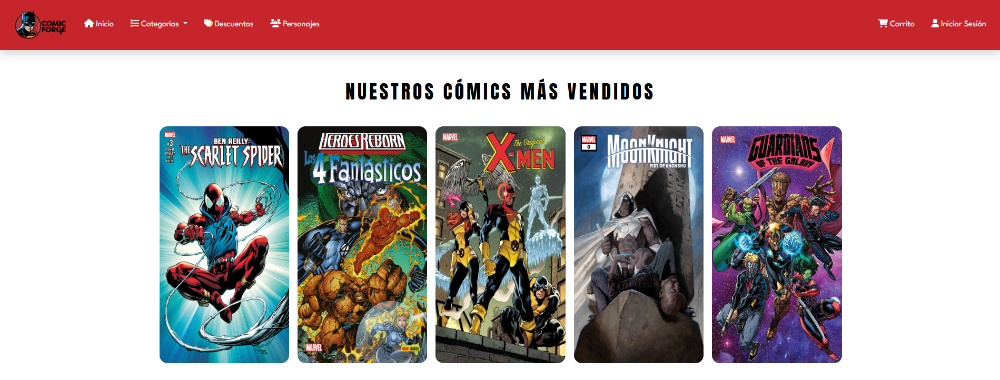
  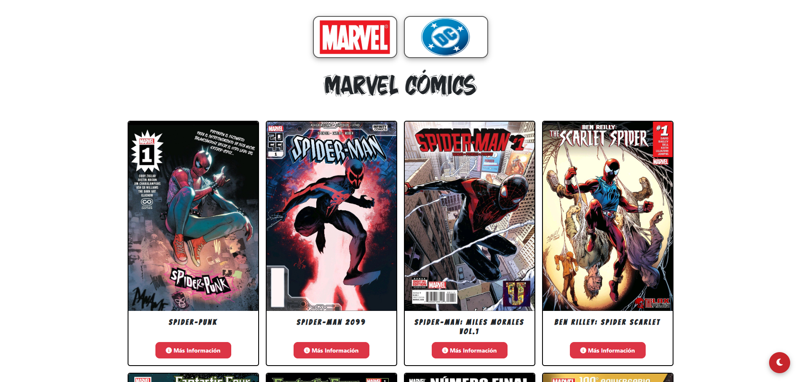
  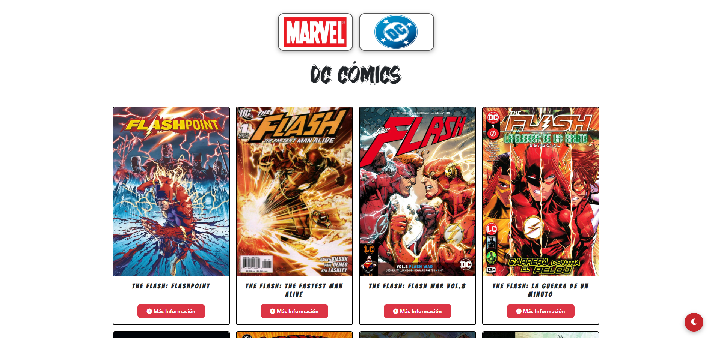
  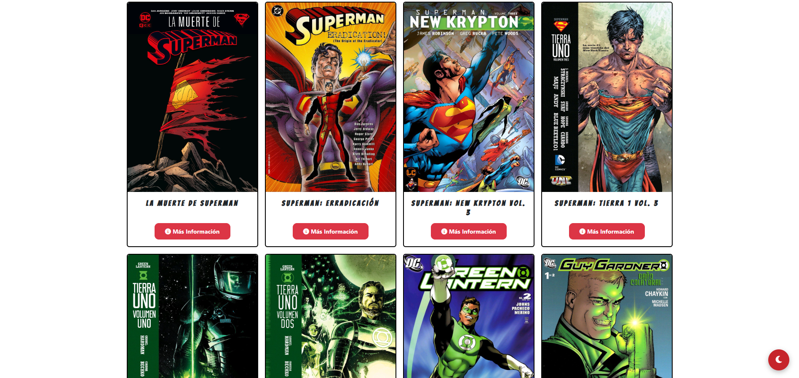
  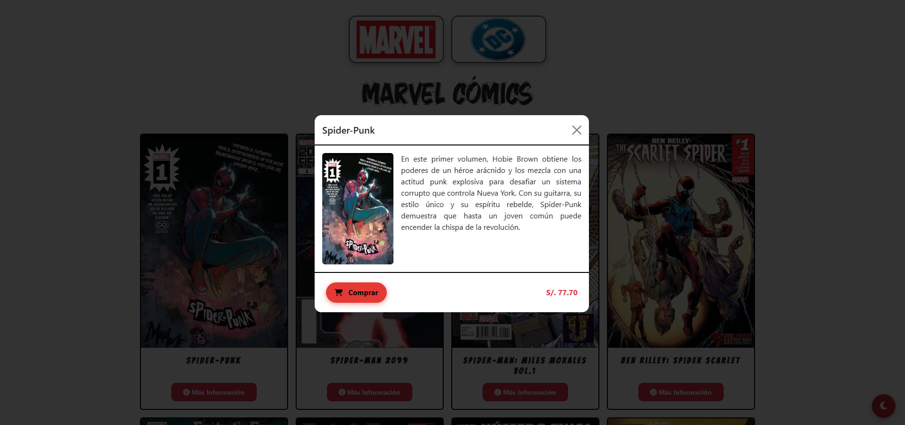
</div>

<div align="center">
  <h3>Autenticacion</h3>
  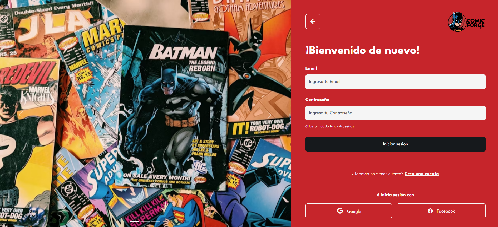
  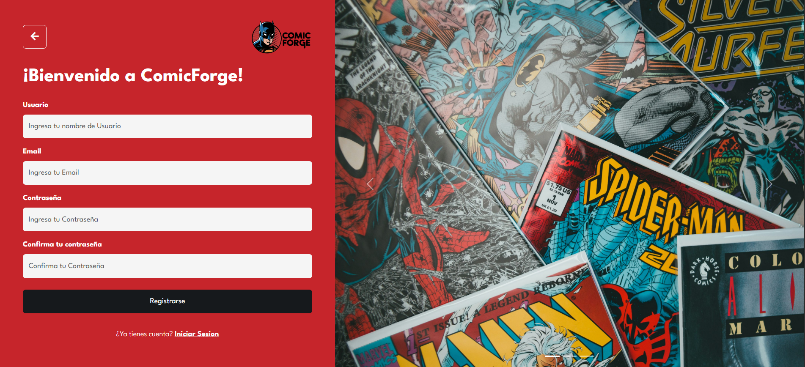
</div>

<div align="center">
  <h3>Secciones</h3>
  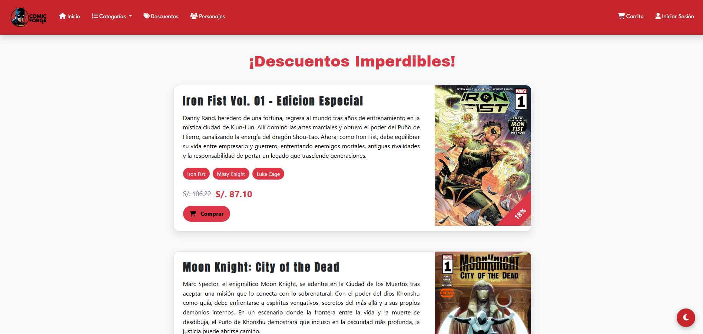
  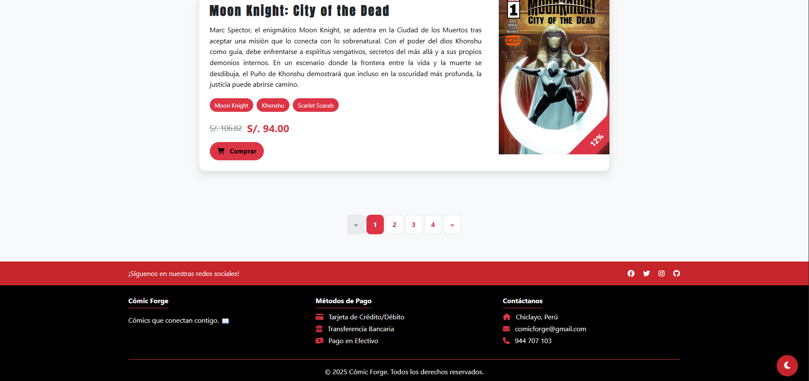
  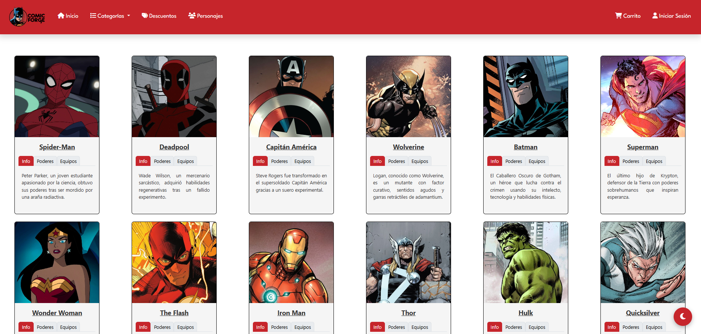
  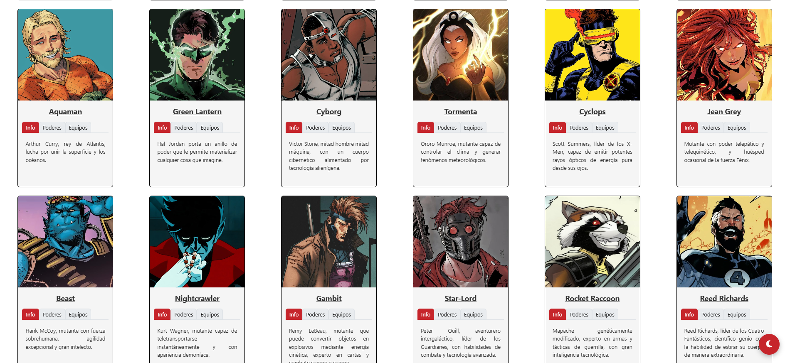
</div>

<div align="center">
  <h3>Perfil de Usuario</h3>
  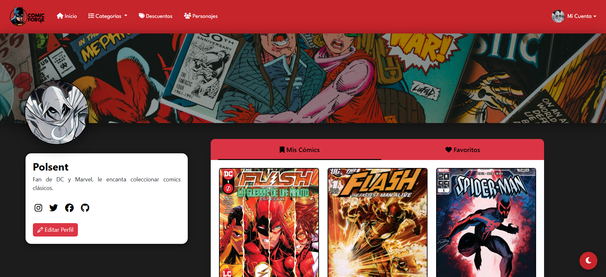
  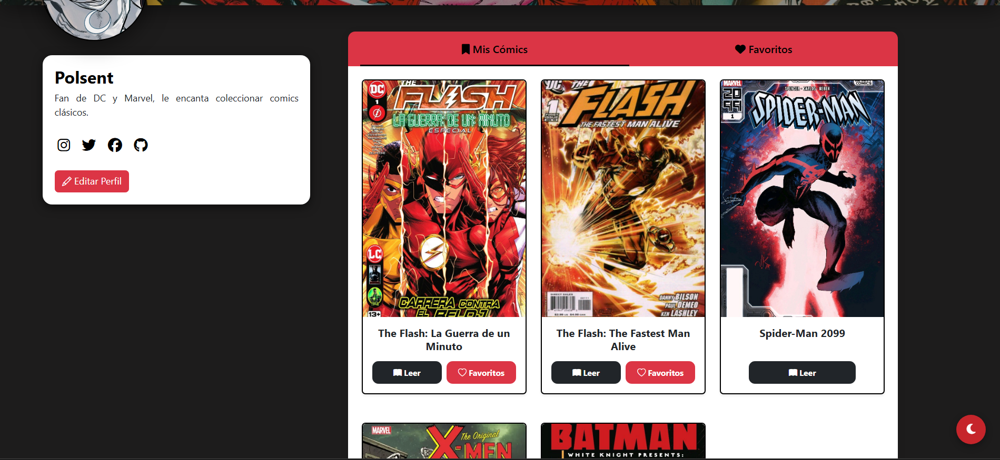
  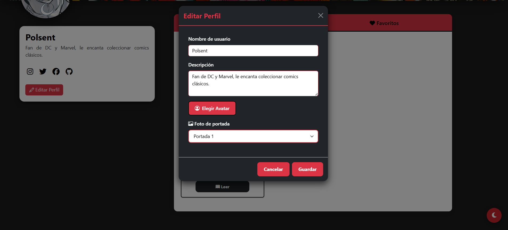
  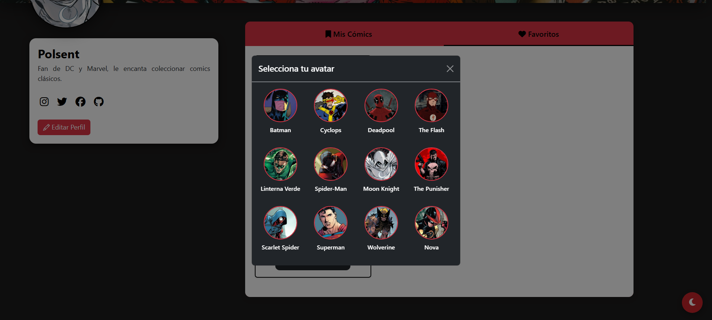
</div>

<div align="center">
  <h3>Carrito y Lector</h3>
  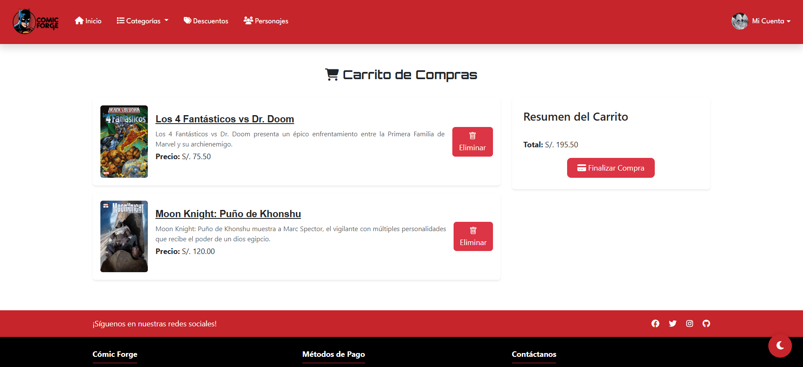
  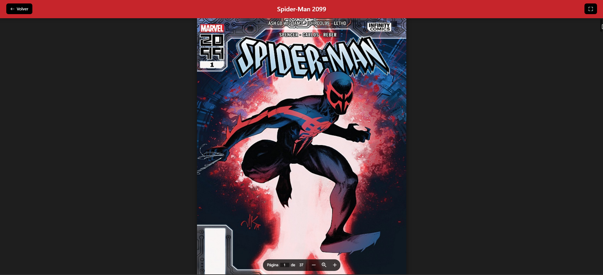
</div>

---

## Caracteristicas

### Autenticacion y Seguridad
- Registro e inicio de sesion con email
- Autenticacion OAuth2 con Google
- Roles de usuario (Cliente / Administrador)
- Tokens JWT con expiracion
- Proteccion CSRF y BCrypt

### Perfiles de Usuario
- Avatar personalizable (12 superheroes)
- Biografia y portada personalizada
- Biblioteca de comics comprados
- Sistema de favoritos
- Historial de compras

### Catalogo de Comics
- Navegacion por editoriales (Marvel, DC)
- Seccion de mas vendidos y descuentos
- Busqueda por titulo y editorial
- Modal con detalles completos
- Tarjetas con portada, precio y descuento

### Carrito de Compras
- Agregar y gestionar multiples comics
- Validacion de productos ya adquiridos
- Prevencion de duplicados
- Calculo automatico del total
- Checkout simplificado

### Lector de Comics
- Visualizacion de PDF pagina por pagina
- Soporte para Google Drive
- Modo doble pagina
- Atajos de teclado
- Pantalla completa (tecla F)

### Panel de Administracion
- Dashboard con estadisticas en tiempo real
- Graficos de ventas (Chart.js)
- CRUD completo de comics
- Gestion de usuarios
- Exportacion de reportes a Excel

---

## Tecnologias

| Backend | Frontend | Base de Datos | Herramientas |
|---------|----------|---------------|--------------|
| Java 17 | HTML5 | MySQL | Maven |
| Spring Boot | CSS3 | JPA/Hibernate | Git |
| Spring Security | JavaScript | | Apache POI |
| Spring OAuth2 | Bootstrap 5 | | Chart.js |
| Thymeleaf | AJAX | | Dotenv |

---

## Arquitectura

- **MVC** (Model-View-Controller)
- **DTO** para transferencia de datos
- **Repository** para acceso a datos
- **Service** para logica de negocio
- **SPA-like** con JavaScript vanilla y AJAX

---

## Como ejecutar

```bash
# 1. Clonar el repositorio
git clone https://github.com/tu-usuario/comic-forge.git

# 2. Configurar base de datos MySQL
# Ejecutar ScriptCreacion.sql en tu gestor MySQL

# 3. Configurar variables de entorno (.env)
GOOGLE_CLIENT_ID=tu_client_id
GOOGLE_CLIENT_SECRET=tu_client_secret
JWT_SECRET=tu_secreto_jwt

# 4. Ejecutar la aplicacion
./mvnw spring-boot:run
```

---

## Licencia
Proyecto academico desarrollado con fines educativos.

## Creditos
Desarrollado por el equipo de Comic Forge.
(c) 2025 Comic Forge